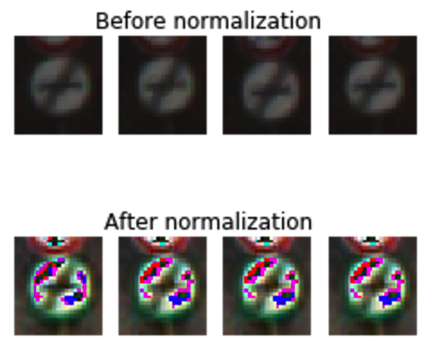

# **Traffic Sign Recognition**
---
**In this project, German Traffic Sign images will be classified using a Convlutional Neural Network**

0. Goals / steps of this project are the following:
* Load the data set (see below for links to the project data set)
* Explore, summarize and visualize the data set
* Design, train and test a model architecture
* Use the model to make predictions on new images
* Analyze the softmax probabilities of the new images
* Summarize the results with a written report

Complete codes and results for this project can be found in the  [`Traffic_Sign_Classifier.ipynb`](https://github.com/udacity/CarND-Traffic-Sign-Classifier-Project/blob/master/Traffic_Sign_Classifier.ipynb)
------

### 1. Data Set Summary & Exploration

#### 1.0 - Where in ipynb?  
Please refer to *Step 1: Dataset Summary & Exploration* in [`Traffic_Sign_Classifier.ipynb`](https://github.com/udacity/CarND-Traffic-Sign-Classifier-Project/blob/master/Traffic_Sign_Classifier.ipynb).  

#### 1.1 - Data set statistics  
*1.1: Basic Summary of the Data Set Using Python, Numpy and/or Pandas* in [`Traffic_Sign_Classifier.ipynb`](https://github.com/udacity/CarND-Traffic-Sign-Classifier-Project/blob/master/Traffic_Sign_Classifier.ipynb).

Pandas library was used to display summaries and matplotlib library to visualize basic statistics of traffic sign data set.

Data set summary:
* Size of training set (`X_train`): 34799
* Size of validation set (`X_validation`): 4410
* Size of testing set (`X_test`): 12630
* Shape of a traffic sign image (width - height - channels): 32 by 32 by 3
* Number of unique classes/labels in the data set: 43 (integer label from 0 to 42)

#### 1.2 - Exploratory visualization of the dataset
*1.2: Exploratory visualization of dataset* in [`Traffic_Sign_Classifier.ipynb`](https://github.com/udacity/CarND-Traffic-Sign-Classifier-Project/blob/master/Traffic_Sign_Classifier.ipynb).

Histogram of label counts:
As can be seen from the histogram, we have randomly distributed numbers of images from each label. However, there is no class with significantly small number of images. Thus, we will not have problem with training all classes with a neural network. Codes can be found in the second cell of section **1.2**.

    

Four sample images from each class:
      
The above image shows that German traffic sign images come in different brightness and may contain multiple instances of nearly same images. Moreover, some signs are hard to read with bare eyes, such as the first and last images of label - 23.  
In this report four sample images from three random labels are displayed. Full list of images can be found in the 5th cell of section **1.2**

Dark/bright images:
    
This image shows traffic sign images from two extreme brightnesses. Some traffic signs may be difficult to distinguish with bare eyes due to they being overly bright or dark. Codes for this section can be found in 6th cell of section **1.2**  

The training data set contained images that are not distinguishable with human eyes. For this reason, training images were pre-processed with normalization method to enhance their visual qualities. However, testing out with the normalized images resulted in worse performance compared to using unprocessed images. This will be further discussed in section 2.1 Pre-process the Data Set.

------
### 2. Design and Test a Model Architecture

#### 2.0 - Where in ipynb?
Please refer to *Step 2: Design and Test a Model Architecture* in [`Traffic_Sign_Classifier.ipynb`](https://github.com/udacity/CarND-Traffic-Sign-Classifier-Project/blob/master/Traffic_Sign_Classifier.ipynb).  

#### 2.1 Pre-process the Data Set
*2.1: Pre-process the Data Set* in
[`Traffic_Sign_Classifier.ipynb`](https://github.com/udacity/CarND-Traffic-Sign-Classifier-Project/blob/master/Traffic_Sign_Classifier.ipynb).

Provided dataset contained images with varying brightness/darkness. Thus, images were pre-processed using a normalization method. Normalizing images was intended to process data dimensions to fall under approximately the same scale  [reference](http://cs231n.github.io/neural-networks-2/#batchnorm).
However, the validation/test accuracies turned out to be worse with the normalized images (0.858 versus 0.911). For this reason, normalization was discarded.  

Possible reason for the worse traning with normalized images could be due to the colors of traffic signs (red, blue, and yellow) contributing significantly to the classification process.  
Below are images of arbitrary traffic signs before and after normalization.

 

#### 2.2 Iput Data
*2.2: Input Data* in [`Traffic_Sign_Classifier.ipynb`](https://github.com/udacity/CarND-Traffic-Sign-Classifier-Project/blob/master/Traffic_Sign_Classifier.ipynb).  
Training, validation, and testing data were provided pre-split in three separate files. Conveniently, there was no need to conduct data splitting process. If I had to, I would have used an `sklearn.model_selection.train_test_split`.   
Data were shuffled with `sklearn.utils. shuffle` to avoid overfitting. In the future work, I will prepare and feed more training/validating/testing images collected from outside source or processed-copy of the original images.

#### 2.3 Model Architecture (Modified LeNet)
*2.3: Model Architecture (Modified LeNet)* in [`Traffic_Sign_Classifier.ipynb`](https://github.com/udacity/CarND-Traffic-Sign-Classifier-Project/blob/master/Traffic_Sign_Classifier.ipynb).

My final model is a slightly modified version of a LeNet. Features added are Local Response Normalization and Dropouts. Final network architecture looks like the following:

| Layer         		|     Description	        					|
|:---------------------:|:---------------------------------------------:|
| Input         		| 32x32x3 RGB image   							|
| Convolution 3x3     	| 1x1 stride, same padding, outputs 28x28x6 	|
| RELU					|												|
| Max pooling	      	| 2x2 stride,  outputs 16x16x64 				|
| Local Resps Normaliz 	|                               				|
|                                                          				|
| Convolution 3x3	    | etc.      									|
| RELU					|												|
| Max pooling	      	| 2x2 stride,  outputs 16x16x64 				|
| Flattening        	| outputs 400                      				|
|                                                          				|
| Fully connected		| output 120        							|
| RELU					|												|
| Dropout   			|												|
|                                                          				|
| Fully connected		| output 84        				    			|
| RELU					|												|
| Dropout   			|												|
|                                                          				|
| Fully connected		| output 10         							|
|                                                          				|
| Output				| logits with size 10(number of labels)         |

#### 2.4 Train, Validate, and Test Model
*2.4: Train, Validate, and Test Model* in
[`Traffic_Sign_Classifier.ipynb`](https://github.com/udacity/CarND-Traffic-Sign-Classifier-Project/blob/master/Traffic_Sign_Classifier.ipynb).

Parameters implemented:
- Optimizer: Adaptive Moment Estimation(Adam) Optimizer
    [reference](http://sebastianruder.com/optimizing-gradient-descent/index.html#adam)
- Batch Size: 100
- Epoch Size: 15
- Dropout Rate: 0.5
- Weight initialization: Truncated Normal Distribution with mean: 0 and standard deviation: 0.1
- Learning Rate: 0.1

Below are the steps taken for training, validating, and testing:  
1. A series of parameter tunings were conducted with trial-and-error with batch size `BATCH_SIZE`, epoch size `EPOCHS`, dropout rate  `dropout`, and learning rate `rate`. Since trial-and-error was somewhat unsystematic method for finding optimal parameters, in the future work I will try to implement a more systematic approach for parameter tuning similar to `sklearn.model_selection.GridSerachCV`.      
2. Training dataset was fed to the model for training.  
3. Validation datasets were fed `EPOCH` number of times and prediction accuracies were measured.  
4. Testing Dataset was fed and prediction accruacy was measured.

#### 2.5 Accuracies of the Model
*2.4: Train, Validate, and Test Model* in
[`Traffic_Sign_Classifier.ipynb`](https://github.com/udacity/CarND-Traffic-Sign-Classifier-Project/blob/master/Traffic_Sign_Classifier.ipynb).

Reported accuarcies are as followed:
* validation set (highest/final): 0.911/0.911
* test set: 0.895

An enhanced version of LeNet was used for traffic sign classification. This did a fairly good job in predicting traffic sign with an accuracy of 0.895 on the testing data set. I deemed this to be a good model for German traffic sign classification because of LeNet's proven history of great performance on image classification **(TODO: add more details)**. Additional features such as dropout and local response normalization were intended to enhance LeNet's performance by preventing overfitting. As mentioned earlier, implementing a more systematic parameter optimization method will guarantee a much higher prediction accuracy.

### 3. Test a Model on New Images
#### 3.0 Where in ipynb?
Please refer to *Step 3: Test a Model on New Images* in [`Traffic_Sign_Classifier.ipynb`](https://github.com/udacity/CarND-Traffic-Sign-Classifier-Project/blob/master/Traffic_Sign_Classifier.ipynb).  

#### 3.1 Image Specifications
Five random German Traffic Signs were capture from Google image search. Five images are displayed below:
    
Label for each image was hard coded by comparing with sample test images from above. From the top, numerical label for each image is 38, 13, 18, 12, and 28  

Images chosen are easy to classify for them having vivid colors and shapes. I assumed that the last image from the list will be the most difficult to classify due to the complex nature of the sign; an image of an adult holding hand of a child.

#### 3.2 Prediction Results

Model prediction of each test image was reported in a list of top 5 likely labels along with % likelyhood of each label.
Here are the results of the prediction:

| Ground Truth		     |     Prediction	        		| Percentage            |
|:---------------------:|:---------------------------------:|:---------------------:|
| 38      	        	| 38   				    			| 99.999%               |
| 13     	    		| 13 								| 100.0%                |
| 18					| 18								|  70.893%               |
| 12	      	    	| 12				 				|  99.965%              |
| 28		        	| 28      							|  97.657%              |

Surprisingly, the model was able to correctly guess 5 of the 5 traffic signs, which gives an accuracy of 100%. This compares favorably to the accuracy on the test set of 0.895
